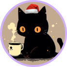

✨

# ✧･ﾟ: *✧･ﾟ:* 欢迎来到我的奇妙世界 *:･ﾟ✧*:･ﾟ✧

*“在色彩与逻辑的交织中，用代码构建优雅的世界。”* 🎨✨

---

  

  

### 关于我 (About Me)

ʕ•́ᴥ•̀ʔっ 嗨！我是一名热爱技术与设计的前端/全栈开发者（或者正在前行的路上！） 
✨ **探索中**：正在不断学习新奇有趣的开发技术~  
🎨 **美学主义**：比起千篇一律，我更喜欢将色彩与活力注入代码之中！  
📝 **日常掉落**：偶尔会在我的[**个人博客**](https://aquamarine-z.github.io/aqua-blog-fuwari/)上写写文章，记录灵光一闪的瞬间。 

---

### 🎨 我的技术调色盘 (Tech Stack)

  
  
  
  
  
  
  
  
  
  

---

### 🔮 Github 魔法书 (Stats)

  
  

  

---

### ✉️ 戳我串门 (Connect with Me)

 

  

